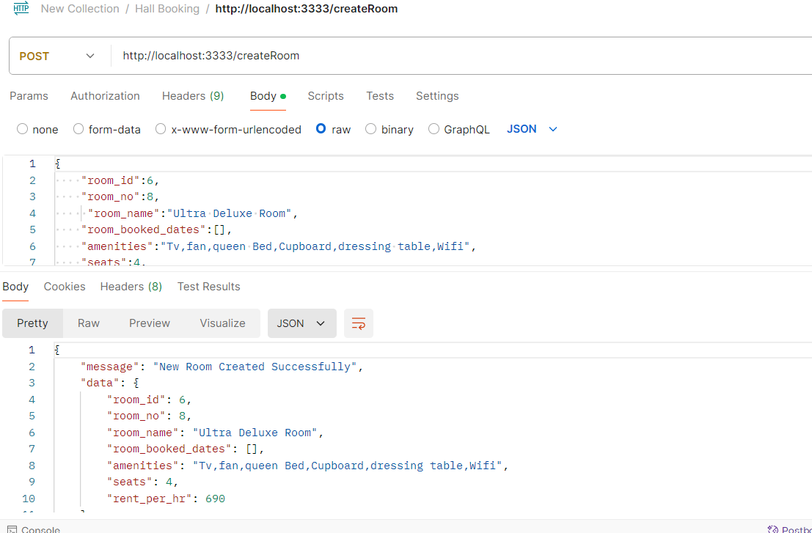
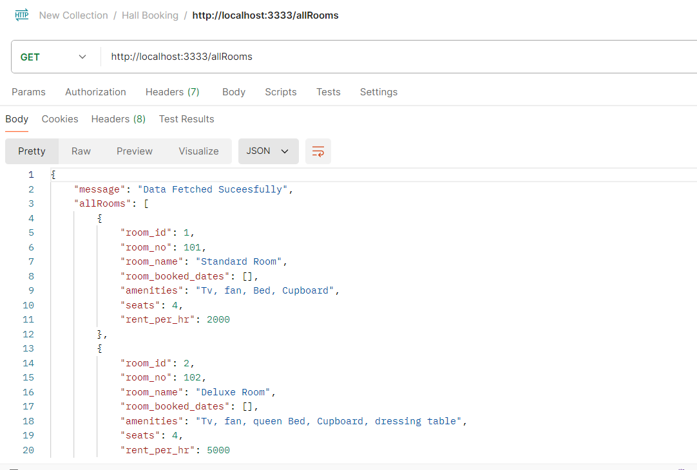
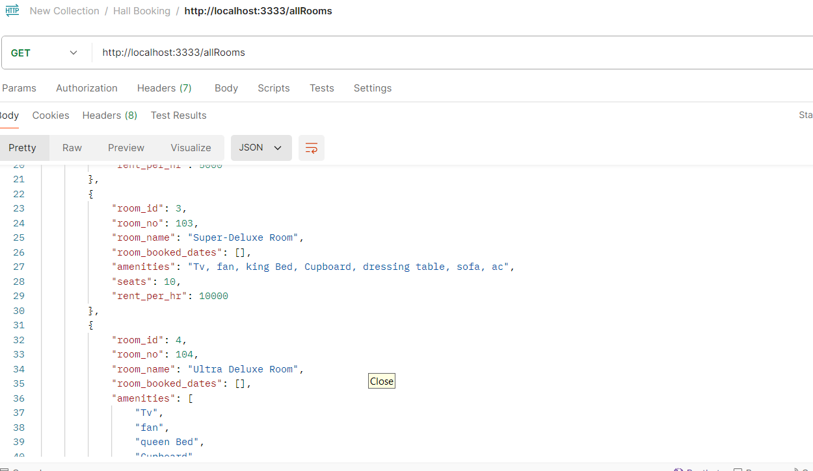
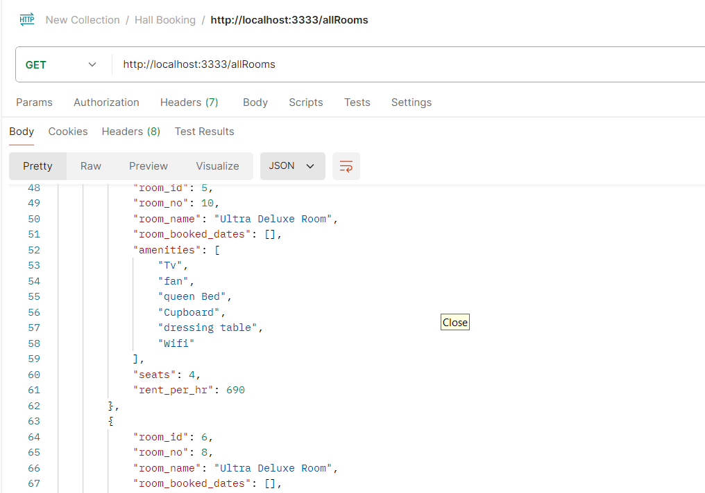
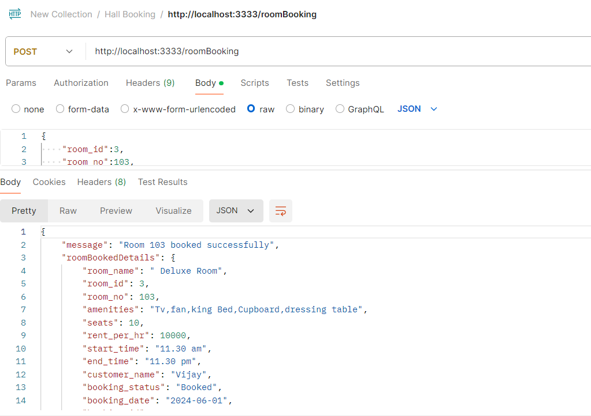
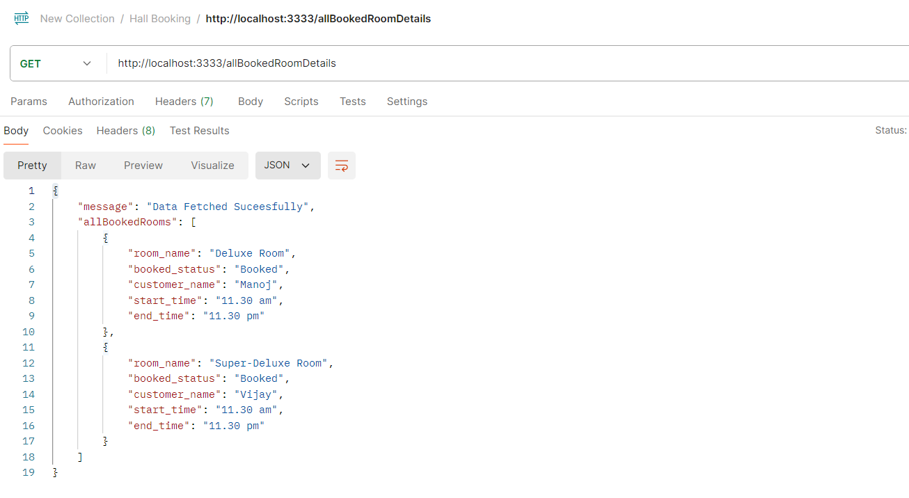
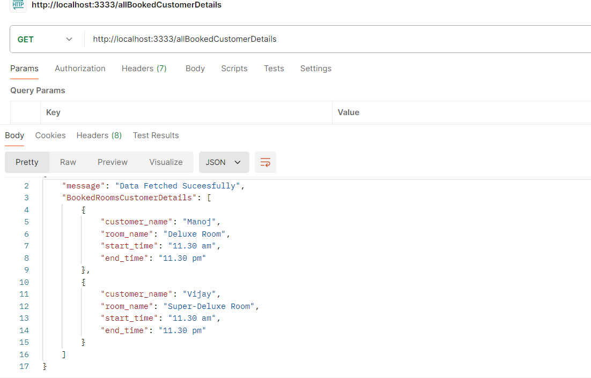
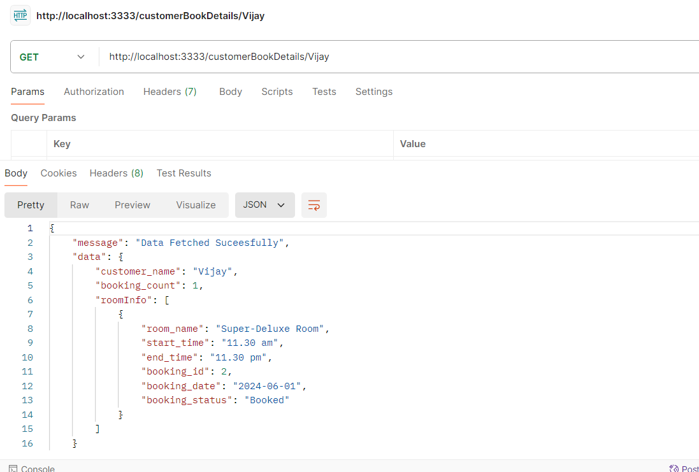

## Hall-Booking-API

This is my Hall Booking Api which was designed using NodeJs and ExpressJs. It's Guvi-Zen class Roadmap session:Day:38 and Nodejs-day-2 Task.

## Tech Stack

- NodeJs
- ExpressJS
- Router()
- json()
- cors
- Nodemon
- date-fns

## Features
- Through this you can create room,book room,view all rooms information and see tha particular person booked details with the help of specified api endpoints.

## Lessons Learned

Through this task I learned to create express server,API endpoints and usage of cors and json().And also i learned to use postman-API Testing Tool and api documentation.

## Testing Tool

I used Postman to test my api endpoints are working fine.

## Screenshots

### Create Room

### All Rooms

### Room Booking

### All Booked Room Details

### All Booked Customer Details

### Customer Book Details

## npm run dev

Runs the app in the development mode.
Open http://localhost:3333 to view it in your browser.

The page will reload when you make changes.

You may also see any lint errors in the console.

